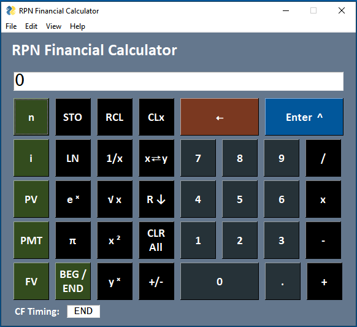
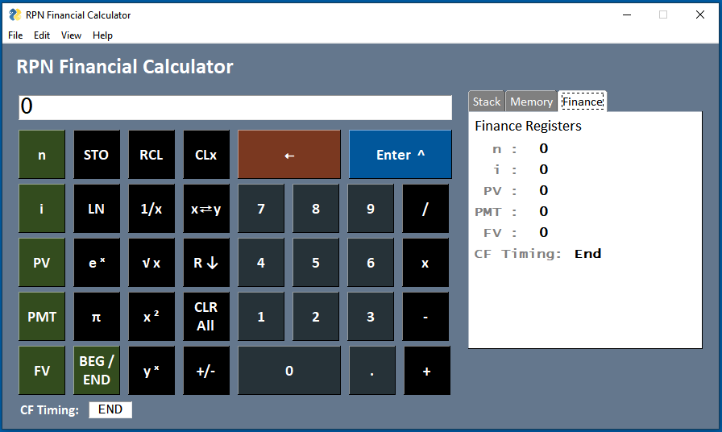

# RPN Financial Calculator
Financial calculator that implements Reverse Polish Notation (RPN).

## Screenshots

### Normal View:

### Internals View with Finance tab selected:

---

## Calculator Features

Some of the main features of the RPN Financial Calculator:

1. Implements the RPN model of data entry and calculation as described in the Performing Calculations section.

2. Allows selection of the number of decimal digits to display or to display a floating decimal point.
   - Note that internal calculations are always done with 9 decimal digits of precision.
   - The number of decimal digits shown can be selected from the View menu item or by right-clicking on the display

3. Accurate calculations, since internal calculations are done with the Python Decimal library.
    - For example, this means that the sum of 0.1 and 0.2 equals 0.3. If this was done with floating point, the result would not be exactly 0.3, since the numbers cannot be exactly represented in binary.

4. Has 9 memory locations
    - The value shown in the display can be stored in a memory location by clicking the STO button followed by the 0 to 9 key to indicate the memory location.
    - A value stored in a memory location can be retrieved by clicking the RCL button followed by the 0 to 9 key to indicate the memory location. The value is pushed onto the stack and shown in the display.  

5. Financial Calculations
    - The calculator can solve financial calculations involving compound interest.
    - See the Performing Financial Calculations section for an overview of capabilities and instructions.

6. View of Calculator Internals
   - The screenshot above shows the Internals View with the Finance tab selected.
   - The Stack tab shows the values in the LIFO stack known as the x, y, z, and t registers.
   - The Memory tab shows the contents of the nine memory registers.
   - The Finance tab shows the contents of the n, i, PV, PMT, and FV registers. It also shows whether cash flows are assumed to occur at the Beginning or the End of each compounding period.
  
7. Can use the Keyboard to Enter Data and Perform Calculations
   - The numeric keypad can be used to enter digits
   - The Enter key can be used to push an entry onto the stack
   - The +, -, *, and / keys can be used to perform addition, subtraction, multiplication, and division operations on the top two values in the stack. The result of the calculation will be pushed back onto the stack.
   - The Backspace key can be used to erase digits that have been entered.
   - The ESC key can be used as a substitute for CLx.

8.  Ability to Copy/Paste the top of the stack to/from the clipboard to interact with other Windows applications.
    - See Copy/Paste in the Edit menu item

9.  Right-click to change the display to/from floating decimal point to a specified number of decimal digits.

## Performing Calculations
For those of you who don't anything about RPN, here is a link to an article that explains its background and development. (see link: [Museum of HP Calculators](https://www.hpmuseum.org/rpn.htm)).

RPN stands for Reverse Prefix Notation or Reverse Polish Notation. RPN was made mainstream by Hewlett-Packard (HP) when they implemented it in their handheld calculators.

RPN is a mathematical notation where the operators are entered after the operands. As a result, there is no need for parentheses or an equals button. As a result, it provides a quick way to enter data and perform calculations because it eliminates the need for parentheses.

For example, suppose you wanted to evaluate the expression: 

>     
> 2 x 3
> 

You would use the following keystrokes:

> 
> 2 E 3 x
> 

(Note: The E character above indicates that the Enter key is clicked. The Enter key separates numeric entries. It also pushes the number onto a LIFO stack.)

As this example indicates, the operands of a calculation are entered first followed by the operator. Since multiplication is a binary operator it pops the last two entries from the stack, performs the multiplication operation, and pushes the result back onto the stack. The top of the stack is always visible in the calculator display.

For a more complicated example, suppose you wanted to evaluate the expression: 

> 
> (( 3 x 4) + (5 x 6)) / 7
> 

You would use the following keystrokes:

> 
> 3 E 4 x 5 E 6 x + 7 E /
>  

This example indicates the power of the stack to store intermediate results for use in chained operations. There is no need to enter parentheses or to store intermediate results in memory to be recalled later.

The elements in the stack are known as x, y, z, and t. The last entry made into the calculator is x. The second to last entry is y. The third to last is z. The fourth to last is t.

When a binary operation (e.g. addition, subtraction, multiplication, division) is performed, it is done with the last two entries, x and y. So, for example, when division is performed the result will be y divided by x. If a number is taken to a power, it will be y to the x power. The result of a calculation is placed back on the stack in the x position, with z moving into the y register and t moving into the z register.

When a unary operation is performed it uses only the x register, which is the last entry made. So, for example, 1/x takes the reciprocal of the x register and replaces the previous value of the x register the result.

The CLx, x⇄y, and R ↓ keys are used to manipulate the stack. The CLx key clears the value in the x register, the x⇄y swaps the values in the x and y registers, and the R ↓ key rotates the values in all four of the registers. The swap key can be especially useful if you got the entries to be used in a binary operation in the opposite order.

I encourage you to spend some time with the Internal View of the application. This view displays the Stack so that you can become acquainted with how the stack operates. Performing the chained calculation in the second example above will give you a good idea.

I believe that once you get some practice with an RPN calculator, it is likely that you will find that it is faster and more efficient than an algebraic calculator where parentheses are necessary or where you must store intermediate results in memory to continue with a chained calculation.

From a personal perspective, I purchased and used my first RPN calculator in 1974. (Yes, I'm an old guy.) It was an HP35 scientific calculator for which I paid the incredible price of $395! (This was a reduction from the introductory price of $495 a couple of years earlier.)

In addition, I purchased an HP12C Financial Calculator in the mid-80s. The HP12C continues to be one of the most used calculators in the field of finance. I continue to use this calculator today. One of the HP12C's main features is the ability to perform financial calculations, such as the future value of an investment given periodic additions and an assumed growth rate or the ability to calculate the payment required to amortize a loan given an interest rate and repayment period.

---

## Performing Financial Calculations
The calculator can solve financial calculations involving compound interest. This section provides an overview of how to enter the data and then provides some examples.

Data for financial calculations are entered using the green keys on the left side of the calculator keyboard. The keys are:
   - n specifies the number of periods for the calculation. For example, for a 30-year mortgage with monthly payments, the number of periods would be 360.
   - i specifies the interest rate per period for the calculation. Thus, a loan with a 6% annual rate paid monthly would have an interest rate of 0.5% per month which is (6% divided by 12 months). 
   - PV specifies the Present Value of a loan or investment. For example, if you borrowed $40,000 for an auto loan, PV would be specified as a positive $40,000. 
   - PMT specifies the payment per period.
   - FV specified the Future Value of a loan or investment.
  
  A financial calculation can be performed by entering data for any four of the five values above. The calculator can then solve for the fifth value.
  
  The sign of the value for PV, PMT, and FV is important. If receiving money, the sign should be positive since this is a positive cash flow. If paying money, the sign should be negative since this is a negative cash flow.
  
  A value can be entered into a financial register by clicking its green key. A value can be retrieved from a financial register by pressing the RCL key followed by its green key.
  
  The BEG/END key specifies whether cash flows occur at the Beginning or the End of each period. (For most calculations, you should specify "End".) 
  
  ---
    
  ## Financial Calculation Examples
  
  ### Example 1: Calculating the Payment on a Loan
  Suppose you get an auto loan for $40,000 at 5.50% per year with a term of 5 years. What would be the monthly payment?
  
  Steps to solve:
  1. Enter the term of the loan into the **n** financial register. This is done with the following keystrokes:
> 3 E 12 x n
>
> (Note: E indicates the Enter key.)
    
    Explanation of the keystrokes above:
       -   3 is the number of years for the loan.
       -   E (abbreviation for the Enter key) The Enter key completes the entry of the number of years.
       -   12 is the number of months per year.
       -   x multiplies 3 by 12, resulting in 36, which is the number of months for the loan.
       -   n enters the value 36 into the n financial register for the number of periods in the loan
  1. Enter the interest rate per period for the loan into the **i** financial register. This is done with the following keystrokes:
> 5.5 E 12 / i
>
> (Note: E represents the Enter key.)
 
    Explanation of the keystrokes above:
       -   5.5 is the annual rate for the loan.
       -   E (abbreviation for the Enter key) The Enter key completes the entry of the annual loan rate.
       -   12 is the number of months per year.
       -   / divides 5.5 by 12, resulting in 0.458333333, which is the rate per month for the loan
       -   i enters the value into the i financial register for the interest rate per month for the loan.
  1. Enter the amount of the loan into **PV** financial register. This is done with the following keystrokes:
> 40000 PV
   
   Note that the sign of PV is positive since this is a positive cash flow to you. (You received $40,000 from the bank.)
  1. Enter 0 into the **FV** financial register, since the future value of the loan will be $0 at the end of the term since it is fully paid. This is done with the following keystrokes:
> 0 FV
  1. Solve for **PMT**. This is done by clicking the PMT button. The display will show the monthly payment for the loan. In this case, the payment would be -764.05 per month. Note that the sign is negative since this is a negative cash flow (you are paying money to the bank for the loan). 

---   
   
### Example 2: Future Value of an Investment
Suppose you invest $250 per month into an investment account that you expect to have a 9% annual growth rate. You start the account with $10,000. How much would you expect the account to be worth in 20 years?

(I assume that you have learned the keystroke sequence from Example 1, so I won't include detailed keystroke information in this example.)

Steps to solve:
1. Enter -10000 into **PV**, since this the initial amount of that you paid into the account at the outset. (You can use the +/- key to change the sign of 10000 to become -10000.)
2. Enter 0.75 into **i**, since this is the monthly expected growth rate (9% per year divided by 12 months per year).
3. Enter -250 into **PMT**, since this is the monthly amount you plan to invest into the account. This amount is a negative cash flow since you will be paying it into the account.
4. Enter 240 into **n**, since this is the number of months you plan to invest (20 years times 12 months per year).
5. Solve for **FV**. The expected future value of the account is $227,063.23. This is a positive number, since if you closed the account, you would receive these funds, which is a positive cash flow.

---

### Example 3: Length of Time to Amortize a Loan
Suppose you have a $10,000 credit card balance on a card with a 22.0% annual rate. How long would it take to pay off the balance if you paid $250 per month, assuming you made no new purchases on the card?
Steps to solve:
1. Enter 10000 into **PV**, since you have received $10,000 from the credit card company.
2. Divide 22 by 12, resulting in 1.83333333, and enter this into **i**. 1.8333333 is the interest rate per month (22% per year divided by 12 months per year).
3. Enter 0 into **FV**, since the card balance will be completely paid.
4. Enter -250 into **PMT**, since you expect to pay $250 per month.
5. Solve for **n**. The result is 72.75, which is the number of months required to pay off the balance on the card. 

---

## Overview of the Software Design of the RPN Financial Calculator Application 

The RPN Financial calculator is implemented entirely in Python. It takes advantage of the following Python packages:
- PySimpleGUI (see link: [PySimpleGUI](https://www.pysimplegui.org))
- decimal (see link: [decimal](https://docs.python.org/3/library/decimal.html))
- numpy-financial (see link: [numpy-financial](https://numpy.org/numpy-financial/latest/index.html))

The application has two modules:
1. main.py: This is the main module. It implements the entire graphical user interface (GUI) using the PySimpleGUI library. It takes advantage of many of the PySimpleGUI elements, including:
   - Text
   - Button
   - Popup
   - Menu
   - Column
   - Right-click menu
   - Tabs
2. Calculator.py: This module contains a single class called Calculator that implements the internal data and functionality of the calculator. The update method is invoked each time an event is received in the main event loop. The update method returns two values:
   - The value of what should be shown on the calculator display.
   - An error message if one has occurred.